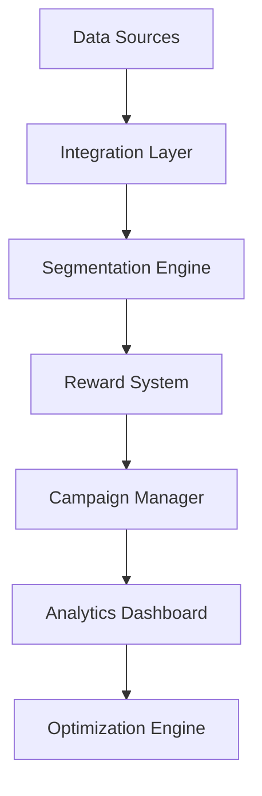

# Customer Loyalty Optimization

Transform your loyalty program into a data-driven engagement engine that drives retention and increases customer lifetime value.

## Overview

This workflow helps retail businesses optimize their loyalty programs by analyzing customer behavior, purchase patterns, and engagement metrics to deliver personalized experiences and increase customer retention.

## Implementation Steps

1. **Data Integration**
   - Connect transaction systems
   - Import customer profiles
   - Set up real-time data sync

2. **Segmentation Setup**
   - Define customer segments
   - Configure behavioral triggers
   - Set up automated updates

3. **Reward Program Configuration**
   - Design reward structure
   - Set up earning rules
   - Configure redemption options

4. **Campaign Automation**
   - Create campaign templates
   - Set up trigger rules
   - Configure personalization

5. **Analytics Configuration**
   - Set up dashboards
   - Configure reporting
   - Define KPI tracking

## Technical Architecture

## Success Metrics

- Increase in customer retention rate
- Growth in program participation
- Higher customer lifetime value
- Improved redemption rates
- Better customer satisfaction scores
- Increased Net Promoter Score

## Resources

- [Implementation Guide](./docs/implementation.md)
- [API Documentation](./docs/api-reference.md)
- [Best Practices](./docs/best-practices.md)
- [Case Studies](./docs/case-studies.md)