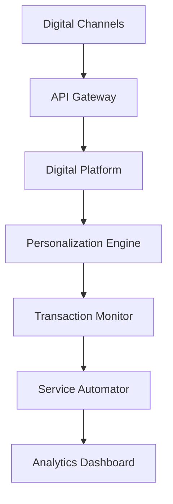

# Digital Banking Transformation

Transform traditional banking into a seamless digital experience with AI-powered personalization.

## Technical Architecture

## Implementation Steps

1. **Platform Setup**
   - Configure digital platform
   - Set up mobile infrastructure
   - Integrate core banking

2. **Personalization Configuration**
   - Set up AI models
   - Configure rules
   - Define segments

3. **Service Automation**
   - Map processes
   - Configure workflows
   - Set up triggers

4. **Security Implementation**
   - Configure authentication
   - Set up monitoring
   - Implement controls

5. **Analytics Setup**
   - Create dashboards
   - Set up tracking
   - Configure reporting

## Success Metrics

- Digital adoption rate
- Mobile engagement
- Service automation rate
- Customer satisfaction
- Digital transaction volume
- Cost per service

## Resources

- [Technical Guide](./docs/technical.md)
- [Security Manual](./docs/security.md)
- [Integration Guide](./docs/integration.md)
- [Best Practices](./docs/best-practices.md)