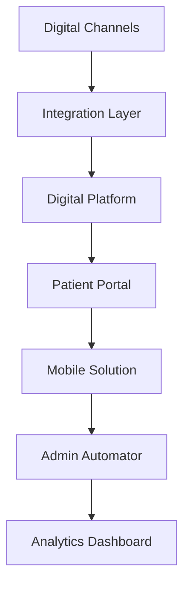

---
id: "digital-health"
title: "Digital Health Transformation"
description: "Transform healthcare delivery with digital platforms and patient engagement solutions."
industryId: "healthcare"
tags:
  - "digital"
  - "engagement"
  - "transformation"
  - "patient-experience"
image: "https://images.unsplash.com/photo-1576091160550-2173dba999ef?auto=format&fit=crop&w=800&q=80"
features:
  - "Digital patient engagement"
  - "Virtual care delivery"
  - "Patient portal integration"
  - "Mobile health solutions"
  - "Administrative automation"
  - "Digital communication"
components:
  - name: "Digital Platform"
    description: "Comprehensive digital health delivery and engagement platform"
  - name: "Patient Portal"
    description: "Integrated patient access and communication system"
  - name: "Mobile Solution"
    description: "Mobile-first health service delivery platform"
  - name: "Admin Automator"
    description: "Administrative process automation system"
requirements:
  - "EHR integration"
  - "Patient portal platform"
  - "Mobile infrastructure"
  - "Communication system"
  - "Security framework"
implementation_steps:
  - title: "Platform Setup"
    tasks:
      - "Deploy digital platform"
      - "Configure integrations"
      - "Set up security"
  - title: "Portal Integration"
    tasks:
      - "Connect patient portal"
      - "Configure access"
      - "Set up features"
  - title: "Mobile Configuration"
    tasks:
      - "Deploy mobile platform"
      - "Enable features"
      - "Test functionality"
  - title: "Process Automation"
    tasks:
      - "Map workflows"
      - "Configure automation"
      - "Set up triggers"
  - title: "Analytics Setup"
    tasks:
      - "Create dashboards"
      - "Enable tracking"
      - "Configure reporting"

## Technical Architecture

---