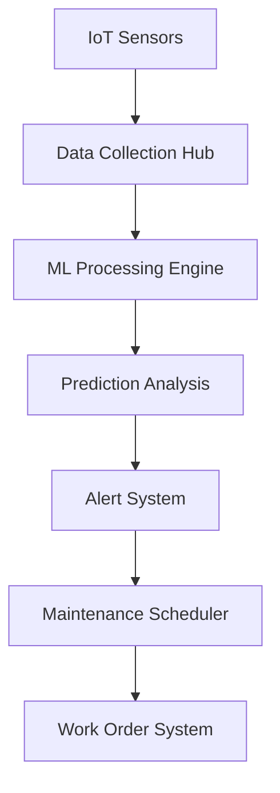

# Predictive Maintenance Workflow

Transform your maintenance operations from reactive to predictive using advanced IoT sensors and machine learning.

## Overview

This workflow enables manufacturing facilities to predict equipment failures before they occur, optimizing maintenance schedules and reducing costly downtime. By combining IoT sensor data with machine learning algorithms, maintenance teams can move from reactive to predictive maintenance strategies.

## Implementation Steps

1. **Sensor Deployment**
   - Install IoT sensors on critical equipment
   - Configure data collection parameters
   - Set up network connectivity

2. **Data Integration**
   - Connect sensor data to central hub
   - Import historical maintenance records
   - Set up real-time data processing

3. **Model Training**
   - Train ML models on historical data
   - Validate prediction accuracy
   - Fine-tune algorithms

4. **System Configuration**
   - Set up alert thresholds
   - Configure notification rules
   - Define maintenance workflows

5. **Team Onboarding**
   - Train maintenance teams
   - Establish response procedures
   - Set up performance monitoring

## Technical Architecture

## Success Metrics

- Reduction in unplanned downtime
- Increase in equipment lifespan
- Decrease in maintenance costs
- Improvement in maintenance team efficiency
- ROI on predictive maintenance system

## Resources

- [Technical Documentation](./docs/technical.md)
- [API Reference](./docs/api.md)
- [Deployment Guide](./docs/deployment.md)
- [Best Practices](./docs/best-practices.md)