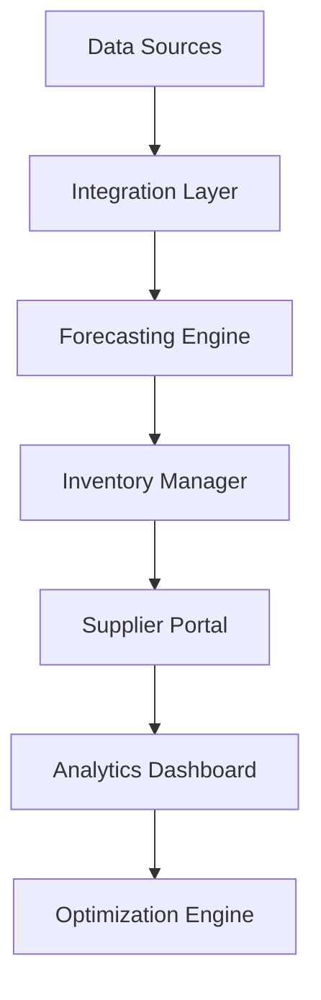

# Inventory Turnover Optimization

Transform your inventory management with AI-powered optimization and automated stock control.

## Overview

This workflow helps retailers optimize their inventory levels and turnover rates using AI-powered demand forecasting and automated inventory management.

## Implementation Steps

1. **Data Integration**
   - Connect POS systems
   - Import historical data
   - Set up supplier feeds

2. **Forecasting Setup**
   - Configure models
   - Train algorithms
   - Validate predictions

3. **Automation Configuration**
   - Set reorder points
   - Configure rules
   - Define thresholds

4. **Supplier Integration**
   - Set up portal
   - Configure communications
   - Establish workflows

5. **Performance Monitoring**
   - Create dashboards
   - Set up alerts
   - Configure reporting

## Technical Architecture

## Success Metrics

- Improved turnover rate
- Reduced carrying costs
- Lower stock-out rates
- Better order accuracy
- Higher fill rates
- Optimized inventory levels

## Resources

- [System Guide](./docs/architecture.md)
- [Configuration Manual](./docs/configuration.md)
- [Maintenance Guide](./docs/maintenance.md)
- [Best Practices](./docs/best-practices.md)