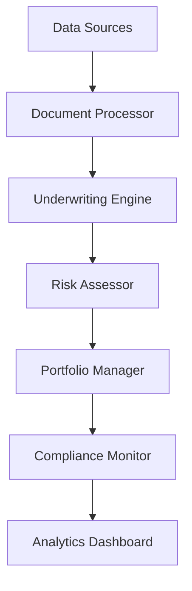

# Mortgage Process Optimization

Transform mortgage operations with AI-powered automation and risk assessment.

## Overview

This workflow helps banks optimize their mortgage operations through automated processing and intelligent risk assessment.

## Implementation Steps

1. **System Integration**
   - Connect document system
   - Import credit data
   - Set up valuations

2. **Process Automation**
   - Configure workflows
   - Set up rules
   - Define triggers

3. **Risk Configuration**
   - Set up models
   - Configure thresholds
   - Define policies

4. **Portfolio Setup**
   - Create dashboards
   - Configure monitoring
   - Set up reporting

5. **Compliance Integration**
   - Configure checks
   - Set up validation
   - Enable tracking

## Technical Architecture

## Success Metrics

- Processing speed
- Decision accuracy
- Risk management
- Portfolio performance
- Compliance rate
- Cost efficiency

## Resources

- [System Guide](./docs/system.md)
- [Process Manual](./docs/process.md)
- [Risk Guide](./docs/risk.md)
- [Best Practices](./docs/best-practices.md)