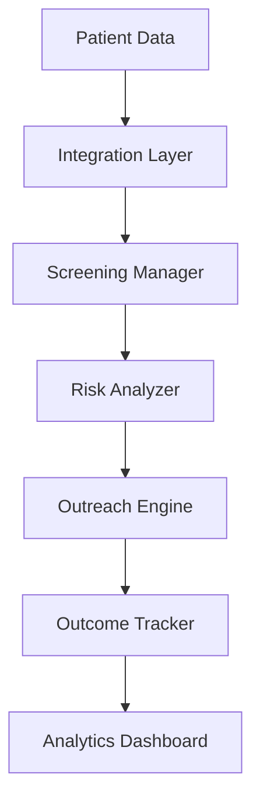

---
id: "preventive-care"
title: "Preventive Care Optimization"
description: "Enhance preventive care outcomes with proactive screening and patient engagement."
industryId: "healthcare"
tags:
  - "preventive"
  - "screening"
  - "engagement"
  - "outcomes"
image: "https://images.unsplash.com/photo-1631815588090-d4bfec5b1ccb?auto=format&fit=crop&w=800&q=80"
features:
  - "Screening program management"
  - "Risk stratification"
  - "Patient outreach automation"
  - "Outcome tracking"
  - "Engagement monitoring"
  - "Intervention optimization"
components:
  - name: "Screening Manager"
    description: "Comprehensive screening program management platform"
  - name: "Risk Analyzer"
    description: "Advanced risk stratification and analysis system"
  - name: "Outreach Engine"
    description: "Automated patient engagement and communication platform"
  - name: "Outcome Tracker"
    description: "Real-time outcome monitoring and analytics system"
requirements:
  - "Patient records system"
  - "Communication platform"
  - "Risk assessment tools"
  - "Engagement tracking"
  - "Analytics platform"
implementation_steps:
  - title: "Program Setup"
    tasks:
      - "Define screening protocols"
      - "Configure workflows"
      - "Set up tracking"
  - title: "Risk Configuration"
    tasks:
      - "Import patient data"
      - "Configure models"
      - "Set thresholds"
  - title: "Outreach Setup"
    tasks:
      - "Define campaigns"
      - "Configure automation"
      - "Set up monitoring"
  - title: "Outcome Monitoring"
    tasks:
      - "Define metrics"
      - "Create dashboards"
      - "Enable tracking"
  - title: "Analytics Configuration"
    tasks:
      - "Set up reporting"
      - "Configure alerts"
      - "Enable analysis"

## Technical Architecture

---