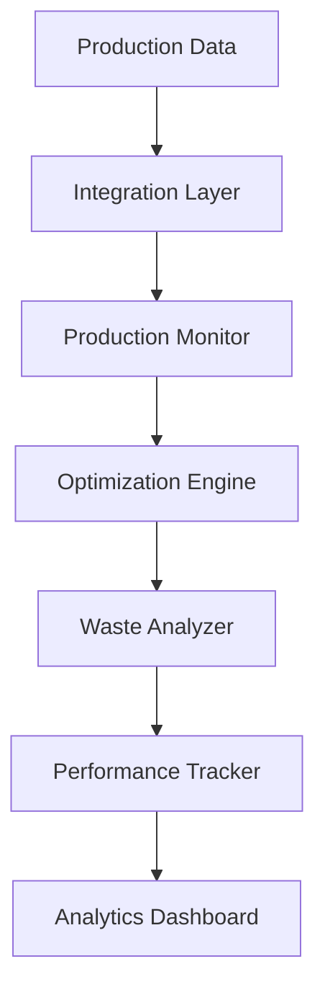

---
id: "production-efficiency"
title: "Production Efficiency Optimization"
description: "Maximize manufacturing output and reduce waste through AI-powered production optimization and real-time analytics."
industryId: "manufacturing"
tags:
  - "production"
  - "optimization"
  - "efficiency"
  - "automation"
image: "https://images.unsplash.com/photo-1581091226825-a6a2a5aee158?auto=format&fit=crop&w=800&q=80"
features:
  - "Real-time production monitoring"
  - "Bottleneck detection"
  - "Waste reduction analysis"
  - "Output optimization"
  - "Quality control integration"
  - "Performance analytics"
components:
  - name: "Production Monitor"
    description: "Real-time production line monitoring and analysis system"
  - name: "Optimization Engine"
    description: "AI-powered production scheduling and optimization platform"
  - name: "Waste Analyzer"
    description: "Advanced waste detection and reduction system"
  - name: "Performance Tracker"
    description: "Comprehensive production performance monitoring platform"
requirements:
  - "Production line sensors"
  - "Quality control system"
  - "Machine data access"
  - "Process control system"
  - "Performance metrics data"
implementation_steps:
  - title: "System Integration"
    tasks:
      - "Connect production systems"
      - "Install sensors"
      - "Set up monitoring"
  - title: "Optimization Setup"
    tasks:
      - "Configure algorithms"
      - "Define constraints"
      - "Set parameters"
  - title: "Waste Management"
    tasks:
      - "Map waste points"
      - "Set up tracking"
      - "Configure alerts"
  - title: "Performance Monitoring"
    tasks:
      - "Create dashboards"
      - "Set up KPIs"
      - "Enable reporting"
  - title: "Process Automation"
    tasks:
      - "Define workflows"
      - "Configure triggers"
      - "Set up actions"

## Technical Architecture

---