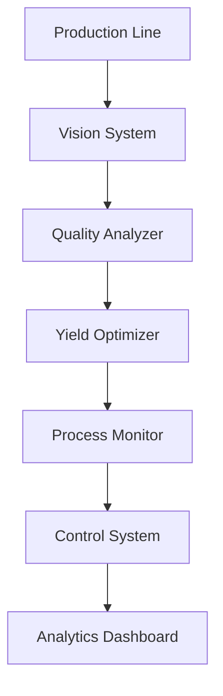

---
id: "quality-control"
title: "Quality Control Enhancement"
description: "Optimize manufacturing quality control with AI-powered defect detection and yield improvement."
industryId: "manufacturing"
tags:
  - "quality"
  - "inspection"
  - "defects"
  - "yield"
image: "https://images.unsplash.com/photo-1581092334651-ddf26d9a09d0?auto=format&fit=crop&w=800&q=80"
features:
  - "AI vision inspection"
  - "Defect prediction"
  - "Yield optimization"
  - "Quality analytics"
  - "Process control"
  - "Performance tracking"
components:
  - name: "Vision System"
    description: "AI-powered visual inspection and defect detection platform"
  - name: "Quality Analyzer"
    description: "Advanced quality analysis and prediction system"
  - name: "Yield Optimizer"
    description: "Intelligent yield optimization and improvement engine"
  - name: "Process Monitor"
    description: "Real-time process control and monitoring platform"
requirements:
  - "Vision system hardware"
  - "Quality control data"
  - "Process control system"
  - "Performance metrics"
  - "Training data sets"
implementation_steps:
  - title: "System Setup"
    tasks:
      - "Install hardware"
      - "Configure cameras"
      - "Set up monitoring"
  - title: "Model Training"
    tasks:
      - "Collect data"
      - "Train models"
      - "Validate accuracy"
  - title: "Process Integration"
    tasks:
      - "Connect systems"
      - "Configure alerts"
      - "Set up controls"
  - title: "Performance Monitoring"
    tasks:
      - "Define metrics"
      - "Create dashboards"
      - "Enable reporting"
  - title: "Team Training"
    tasks:
      - "Train operators"
      - "Set procedures"
      - "Document processes"

## Technical Architecture

---