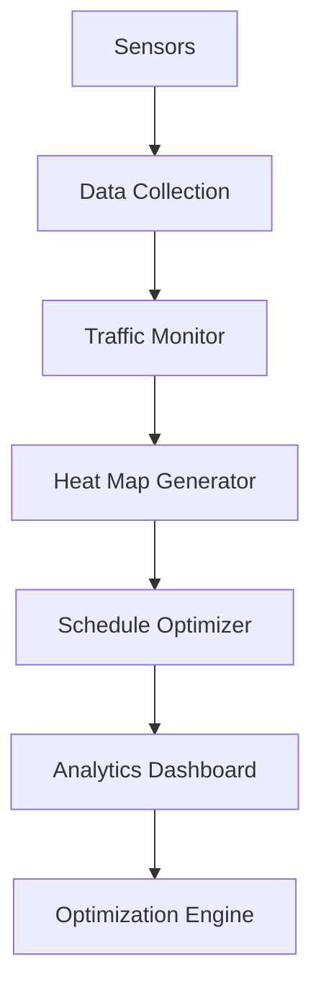

# Store Traffic Analysis

Transform your store operations with data-driven insights and real-time traffic optimization.

## Overview

This workflow enables retailers to analyze foot traffic patterns, optimize store layouts, and improve conversion rates through data-driven insights.

## Implementation Steps

1. **Sensor Installation**
   - Deploy counters
   - Set up cameras
   - Configure network

2. **Data Collection**
   - Configure tracking
   - Set up storage
   - Enable real-time sync

3. **Analytics Setup**
   - Create dashboards
   - Configure alerts
   - Set up reporting

4. **Optimization Configuration**
   - Define KPIs
   - Set thresholds
   - Configure automation

5. **Team Training**
   - Train staff
   - Set up procedures
   - Establish workflows

## Technical Architecture

## Success Metrics

- Increased foot traffic
- Better conversion rates
- Optimized staffing levels
- Improved store layout
- Higher sales per visitor
- Enhanced customer experience

## Resources

- [Hardware Guide](./docs/hardware.md)
- [Analytics Manual](./docs/analytics.md)
- [Optimization Guide](./docs/optimization.md)
- [Best Practices](./docs/best-practices.md)