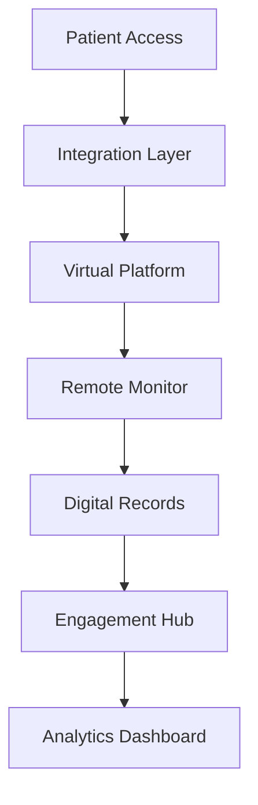

---
id: "telehealth"
title: "Telehealth Platform Optimization"
description: "Maximize telehealth service delivery with enhanced virtual care capabilities and patient engagement."
industryId: "healthcare"
tags:
  - "telehealth"
  - "virtual-care"
  - "remote-health"
  - "digital"
image: "https://images.unsplash.com/photo-1576091160399-112ba8d25d1d?auto=format&fit=crop&w=800&q=80"
features:
  - "Virtual consultation platform"
  - "Remote monitoring integration"
  - "Digital health records"
  - "Secure messaging"
  - "Appointment management"
  - "Patient engagement tools"
components:
  - name: "Virtual Platform"
    description: "Comprehensive telehealth service delivery platform"
  - name: "Remote Monitor"
    description: "Remote patient monitoring and tracking system"
  - name: "Digital Records"
    description: "Integrated digital health records platform"
  - name: "Engagement Hub"
    description: "Patient engagement and communication center"
requirements:
  - "Video platform"
  - "EHR integration"
  - "Monitoring devices"
  - "Security system"
  - "Communication platform"
implementation_steps:
  - title: "Platform Setup"
    tasks:
      - "Deploy telehealth platform"
      - "Configure video system"
      - "Set up security"
  - title: "Integration Configuration"
    tasks:
      - "Connect EHR system"
      - "Set up monitoring"
      - "Enable sharing"
  - title: "Workflow Setup"
    tasks:
      - "Define processes"
      - "Configure automation"
      - "Set up routing"
  - title: "Engagement Configuration"
    tasks:
      - "Set up messaging"
      - "Configure notifications"
      - "Enable scheduling"
  - title: "Analytics Setup"
    tasks:
      - "Create dashboards"
      - "Enable tracking"
      - "Configure reporting"

## Technical Architecture

---