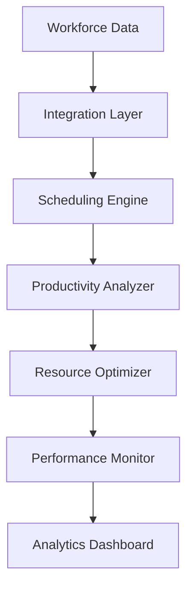

---
id: "workforce-optimization"
title: "Workforce Optimization"
description: "Maximize workforce efficiency with AI-powered scheduling and resource optimization."
industryId: "manufacturing"
tags:
  - "workforce"
  - "scheduling"
  - "optimization"
  - "productivity"
image: "https://images.unsplash.com/photo-1581092918056-0c4c3acd3789?auto=format&fit=crop&w=800&q=80"
features:
  - "Smart shift scheduling"
  - "Labor utilization tracking"
  - "Productivity analysis"
  - "Overtime reduction"
  - "Performance monitoring"
  - "Resource planning"
components:
  - name: "Scheduling Engine"
    description: "AI-powered workforce scheduling and optimization platform"
  - name: "Productivity Analyzer"
    description: "Advanced productivity analysis and tracking system"
  - name: "Resource Optimizer"
    description: "Intelligent resource allocation and planning engine"
  - name: "Performance Monitor"
    description: "Real-time performance monitoring and analytics platform"
requirements:
  - "Workforce data"
  - "Time tracking system"
  - "Performance metrics"
  - "Scheduling platform"
  - "Resource management system"
implementation_steps:
  - title: "Data Integration"
    tasks:
      - "Connect systems"
      - "Import data"
      - "Set up tracking"
  - title: "Schedule Optimization"
    tasks:
      - "Define rules"
      - "Configure algorithms"
      - "Set constraints"
  - title: "Resource Planning"
    tasks:
      - "Map resources"
      - "Set allocations"
      - "Define roles"
  - title: "Performance Tracking"
    tasks:
      - "Define metrics"
      - "Create dashboards"
      - "Enable reporting"
  - title: "Process Automation"
    tasks:
      - "Configure workflows"
      - "Set up alerts"
      - "Enable notifications"

## Technical Architecture

---