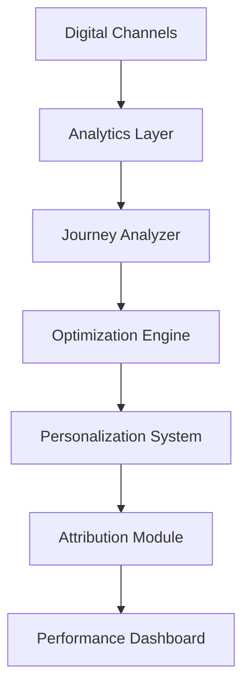

# Digital Channel Optimization

Transform your digital channels into high-performing sales engines through data-driven optimization and personalization.

## Overview

This workflow enables retailers to optimize their digital channels by analyzing customer behavior, improving conversion rates, and creating seamless omnichannel experiences.

## Implementation Steps

1. **Digital Channel Audit**
   - Assess current performance
   - Identify optimization opportunities
   - Map customer journeys

2. **Analytics Setup**
   - Implement tracking
   - Configure goals
   - Set up reporting

3. **Optimization Framework**
   - Define testing strategy
   - Set up A/B testing
   - Configure personalization

4. **Channel Integration**
   - Connect data sources
   - Set up cross-channel tracking
   - Configure attribution

5. **Performance Monitoring**
   - Create dashboards
   - Set up alerts
   - Configure reporting

## Technical Architecture

## Success Metrics

- Increased conversion rate
- Higher average order value
- Reduced cart abandonment
- Improved mobile engagement
- Better channel attribution
- Lower acquisition costs

## Resources

- [Technical Guide](./docs/technical.md)
- [Integration Manual](./docs/integration.md)
- [Optimization Guide](./docs/optimization.md)
- [Best Practices](./docs/best-practices.md)