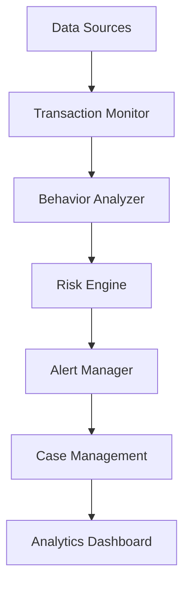

# Fraud Prevention & Detection

Protect your banking operations with advanced AI-powered fraud detection.

## Overview

This workflow helps banks detect and prevent fraud using machine learning and real-time monitoring.

## Implementation Steps

1. **Data Integration**
   - Connect data sources
   - Set up feeds
   - Configure monitoring

2. **Model Setup**
   - Train ML models
   - Configure rules
   - Set thresholds

3. **Alert Configuration**
   - Define workflows
   - Set up routing
   - Configure responses

4. **Team Training**
   - Train analysts
   - Set procedures
   - Define roles

5. **Performance Monitoring**
   - Create dashboards
   - Set up reporting
   - Track metrics

## Technical Architecture

## Success Metrics

- Fraud detection rate
- False positive rate
- Response time
- Prevention rate
- Recovery rate
- Cost savings

## Resources

- [System Guide](./docs/system.md)
- [Model Documentation](./docs/models.md)
- [Alert Guide](./docs/alerts.md)
- [Best Practices](./docs/best-practices.md)