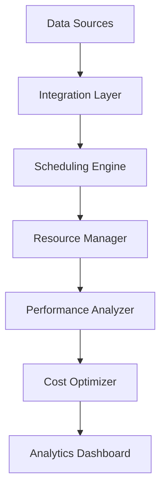

---
id: "operational-efficiency"
title: "Operational Efficiency Optimization"
description: "Maximize healthcare facility operations with AI-powered scheduling and resource optimization."
industryId: "healthcare"
tags:
  - "operations"
  - "scheduling"
  - "efficiency"
  - "automation"
image: "https://images.unsplash.com/photo-1516549655169-df83a0774514?auto=format&fit=crop&w=800&q=80"
features:
  - "Smart OR scheduling"
  - "Resource utilization tracking"
  - "Staff allocation optimization"
  - "Cost efficiency analysis"
  - "Performance monitoring"
  - "Automated reporting"
components:
  - name: "Scheduling Engine"
    description: "AI-powered scheduling optimization and management system"
  - name: "Resource Manager"
    description: "Intelligent resource allocation and tracking platform"
  - name: "Performance Analyzer"
    description: "Real-time performance monitoring and analytics system"
  - name: "Cost Optimizer"
    description: "Advanced cost analysis and optimization platform"
requirements:
  - "OR management system"
  - "Staff scheduling platform"
  - "Resource tracking system"
  - "Cost tracking system"
  - "Performance metrics data"
implementation_steps:
  - title: "System Integration"
    tasks:
      - "Connect OR systems"
      - "Import staff data"
      - "Set up tracking"
  - title: "Scheduling Setup"
    tasks:
      - "Configure algorithms"
      - "Define constraints"
      - "Set priorities"
  - title: "Resource Configuration"
    tasks:
      - "Map resources"
      - "Set utilization rules"
      - "Configure tracking"
  - title: "Performance Monitoring"
    tasks:
      - "Set up dashboards"
      - "Configure alerts"
      - "Enable reporting"
  - title: "Cost Analysis"
    tasks:
      - "Define metrics"
      - "Set up tracking"
      - "Configure optimization"

## Technical Architecture

---