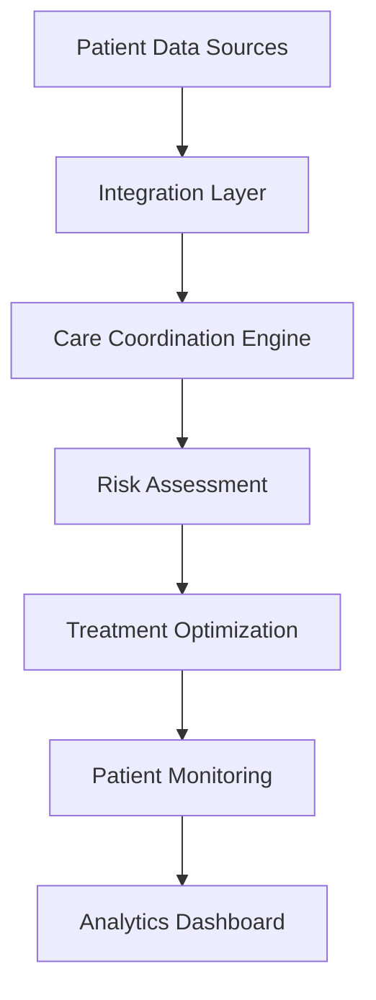

---
id: "patient-care"
title: "Patient Care Enhancement"
description: "Optimize patient care and reduce readmissions using AI-powered care coordination and real-time analytics."
industryId: "healthcare"
tags:
  - "patient-care"
  - "analytics"
  - "coordination"
  - "readmissions"
image: "https://images.unsplash.com/photo-1579684385127-1ef15d508118?auto=format&fit=crop&w=800&q=80"
features:
  - "Real-time patient monitoring"
  - "Care coordination automation"
  - "Readmission risk prediction"
  - "Patient satisfaction tracking"
  - "Treatment plan optimization"
  - "Clinical decision support"
components:
  - name: "Care Coordination Engine"
    description: "AI-powered system for optimizing patient care workflows and coordination"
  - name: "Risk Assessment Platform"
    description: "Advanced risk prediction and analysis system for patient outcomes"
  - name: "Treatment Optimizer"
    description: "Intelligent treatment plan optimization and recommendation engine"
  - name: "Monitoring System"
    description: "Real-time patient monitoring and alert management platform"
requirements:
  - "EHR system integration"
  - "Patient monitoring systems"
  - "Care coordination platform"
  - "Clinical data access"
  - "Patient feedback system"
implementation_steps:
  - title: "Data Integration"
    tasks:
      - "Connect EHR systems"
      - "Import patient records"
      - "Set up monitoring feeds"
  - title: "Risk Model Setup"
    tasks:
      - "Configure predictive models"
      - "Set risk thresholds"
      - "Define triggers"
  - title: "Care Coordination"
    tasks:
      - "Map care workflows"
      - "Set up automation"
      - "Configure alerts"
  - title: "Patient Monitoring"
    tasks:
      - "Deploy monitoring system"
      - "Set up alerts"
      - "Configure dashboards"
  - title: "Analytics Configuration"
    tasks:
      - "Create reports"
      - "Set up KPIs"
      - "Enable tracking"

## Technical Architecture

---