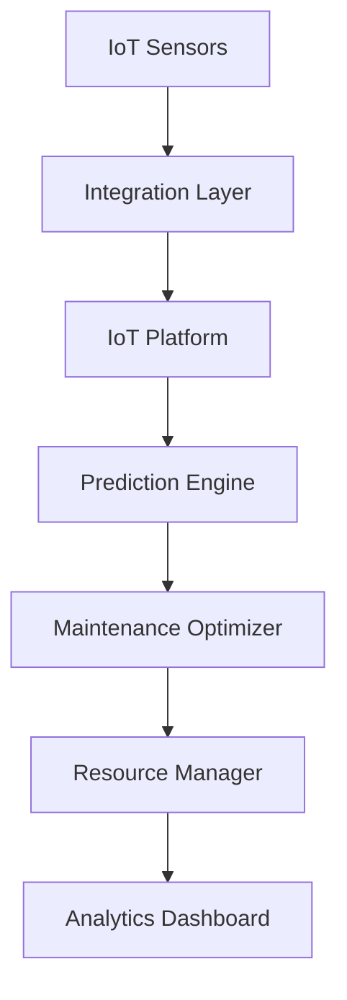

---
id: "predictive-maintenance"
title: "Predictive Maintenance Optimization"
description: "Maximize equipment reliability with IoT-powered predictive maintenance and failure prevention."
industryId: "manufacturing"
tags:
  - "maintenance"
  - "iot"
  - "prediction"
  - "reliability"
image: "https://images.unsplash.com/photo-1581092335397-9583eb92d232?auto=format&fit=crop&w=800&q=80"
features:
  - "IoT sensor monitoring"
  - "Failure prediction"
  - "Maintenance optimization"
  - "Cost reduction analysis"
  - "Performance tracking"
  - "Resource planning"
components:
  - name: "IoT Platform"
    description: "Comprehensive IoT sensor monitoring and data collection system"
  - name: "Prediction Engine"
    description: "ML-powered failure prediction and analysis platform"
  - name: "Maintenance Optimizer"
    description: "Intelligent maintenance scheduling and optimization system"
  - name: "Resource Manager"
    description: "Advanced resource planning and allocation platform"
requirements:
  - "IoT sensors"
  - "Equipment data"
  - "Maintenance history"
  - "Resource data"
  - "Cost tracking system"
implementation_steps:
  - title: "Sensor Deployment"
    tasks:
      - "Install sensors"
      - "Configure network"
      - "Set up monitoring"
  - title: "Model Development"
    tasks:
      - "Collect data"
      - "Train models"
      - "Validate predictions"
  - title: "Schedule Optimization"
    tasks:
      - "Define parameters"
      - "Configure rules"
      - "Set priorities"
  - title: "Resource Planning"
    tasks:
      - "Map resources"
      - "Set allocations"
      - "Configure tracking"
  - title: "Performance Monitoring"
    tasks:
      - "Create dashboards"
      - "Set up alerts"
      - "Enable reporting"

## Technical Architecture

---