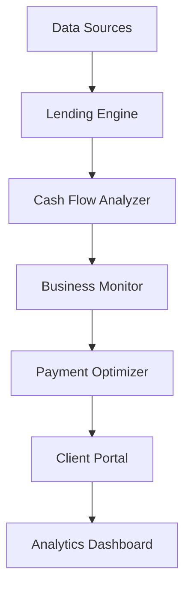

# Small Business Banking

Transform small business banking with automated lending and intelligent insights.

## Overview

This workflow enables banks to better serve small business customers through automated lending decisions and personalized financial guidance.

## Implementation Steps

1. **Data Integration**
   - Connect banking data
   - Import credit data
   - Set up monitoring

2. **Model Configuration**
   - Configure lending models
   - Set up forecasting
   - Define risk rules

3. **Analytics Setup**
   - Create dashboards
   - Configure alerts
   - Set up reporting

4. **Process Automation**
   - Define workflows
   - Set up triggers
   - Configure actions

5. **Client Integration**
   - Set up portal
   - Configure access
   - Enable notifications

## Technical Architecture

## Success Metrics

- Lending efficiency
- Decision accuracy
- Customer satisfaction
- Portfolio performance
- Risk management
- Cost reduction

## Resources

- [Technical Guide](./docs/technical.md)
- [Integration Manual](./docs/integration.md)
- [Risk Guide](./docs/risk.md)
- [Best Practices](./docs/best-practices.md)