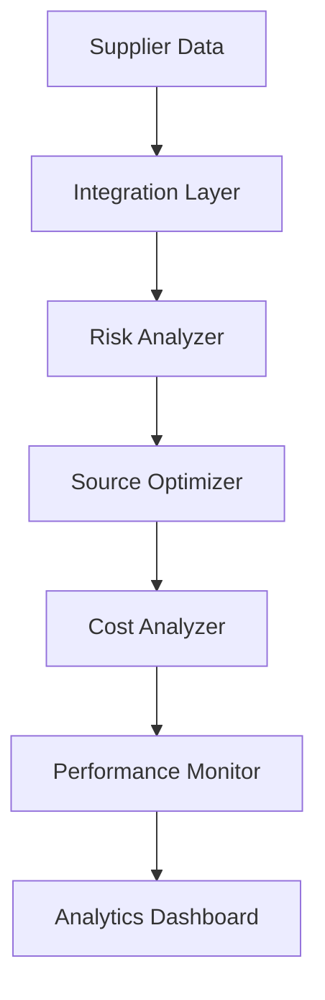

---
id: "supply-chain-risk"
title: "Supply Chain Risk Management"
description: "Optimize supply chain resilience with AI-powered risk assessment and multi-source strategy implementation."
industryId: "manufacturing"
tags:
  - "supply-chain"
  - "risk"
  - "sourcing"
  - "resilience"
image: "https://images.unsplash.com/photo-1586528116311-ad8dd3c8310d?auto=format&fit=crop&w=800&q=80"
features:
  - "Supplier risk assessment"
  - "Multi-source optimization"
  - "Cost impact analysis"
  - "Alternative supplier identification"
  - "Performance monitoring"
  - "Risk mitigation planning"
components:
  - name: "Risk Analyzer"
    description: "Advanced supplier risk assessment and monitoring system"
  - name: "Source Optimizer"
    description: "Multi-source strategy optimization platform"
  - name: "Cost Analyzer"
    description: "Comprehensive cost impact analysis system"
  - name: "Performance Monitor"
    description: "Supplier performance tracking and analytics platform"
requirements:
  - "Supplier data access"
  - "Cost tracking system"
  - "Performance metrics"
  - "Risk assessment tools"
  - "Contract management system"
implementation_steps:
  - title: "Risk Assessment"
    tasks:
      - "Analyze suppliers"
      - "Identify risks"
      - "Set up monitoring"
  - title: "Strategy Development"
    tasks:
      - "Define criteria"
      - "Evaluate alternatives"
      - "Create plans"
  - title: "Cost Analysis"
    tasks:
      - "Calculate impacts"
      - "Model scenarios"
      - "Define thresholds"
  - title: "Performance Tracking"
    tasks:
      - "Set up metrics"
      - "Configure alerts"
      - "Enable reporting"
  - title: "Process Implementation"
    tasks:
      - "Deploy strategy"
      - "Train teams"
      - "Monitor results"

## Technical Architecture

---