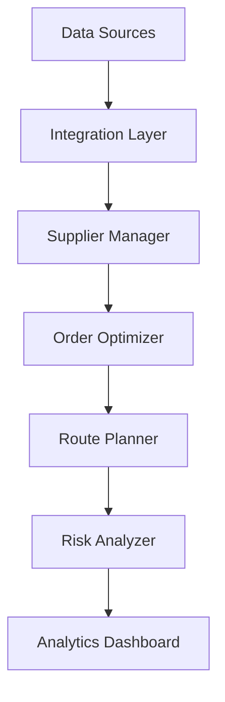

# Supply Chain Optimization

Transform your supply chain operations with intelligent optimization and real-time analytics.

## Overview

This workflow helps retailers optimize their supply chain operations using real-time data analytics and predictive modeling.

## Implementation Steps

1. **Supply Chain Mapping**
   - Document processes
   - Identify bottlenecks
   - Map dependencies

2. **Data Integration**
   - Connect systems
   - Set up feeds
   - Configure sync

3. **Analytics Setup**
   - Create dashboards
   - Configure alerts
   - Set up reporting

4. **Optimization Configuration**
   - Define rules
   - Set thresholds
   - Configure automation

5. **Risk Management**
   - Identify risks
   - Set up monitoring
   - Configure mitigation

## Technical Architecture

## Success Metrics

- Improved order fulfillment
- Reduced lead times
- Lower transportation costs
- Better warehouse efficiency
- Enhanced supplier reliability
- Reduced risk exposure

## Resources

- [Implementation Guide](./docs/implementation.md)
- [Integration Manual](./docs/integration.md)
- [Best Practices](./docs/best-practices.md)
- [Case Studies](./docs/case-studies.md)