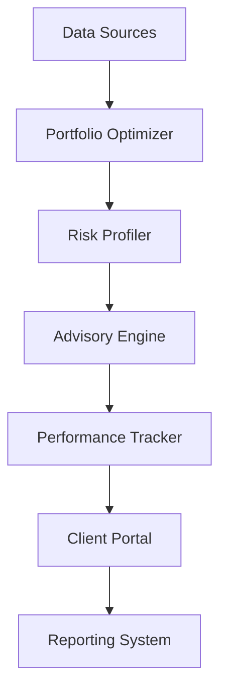

# Wealth Management Optimization

Transform wealth management with AI-powered portfolio optimization and personalized advisory.

## Overview

This workflow enables banks to deliver sophisticated wealth management services through AI-powered optimization and personalization.

## Implementation Steps

1. **Data Setup**
   - Connect market data
   - Import portfolios
   - Set up feeds

2. **Model Configuration**
   - Configure optimization
   - Set up risk models
   - Define strategies

3. **Advisory Setup**
   - Create profiles
   - Configure rules
   - Set thresholds

4. **Reporting Configuration**
   - Design reports
   - Set up automation
   - Configure delivery

5. **Client Integration**
   - Set up portal
   - Configure access
   - Enable communications

## Technical Architecture

## Success Metrics

- Portfolio performance
- Client satisfaction
- Advisory efficiency
- Risk compliance
- Asset growth
- Client retention

## Resources

- [Technical Guide](./docs/technical.md)
- [Model Documentation](./docs/models.md)
- [Integration Guide](./docs/integration.md)
- [Best Practices](./docs/best-practices.md)